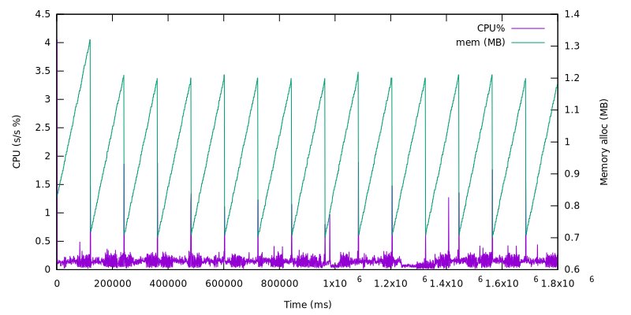
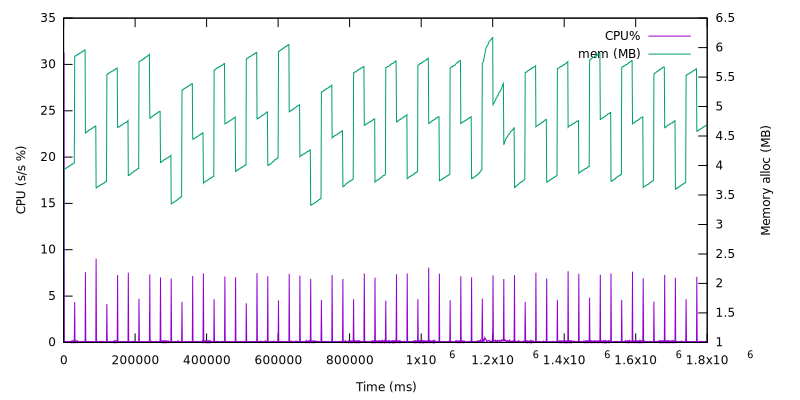

## Docker image

```
docker pull mcluseau/kube-proxy2
```

## Draft of goals

```
[ k8s API ] ----> [ local model ] ----> [plugin] ----> [aggregator] ----> [subsystem]
```

* build an intermediate model specific to represent the expected node-local state (ENLS)
* digest API server's changes to the ENLS
  * trigger events only when the ENLS changes (not on every API event)
  * naturally decouples and factorizes proxy-specific logic
* ENLS should be serializable in protobuf, and may be available through an API (internal?)
  * should ease debugging
  * should ease independant updates on each side of this API (k8s semantics before ENLS, subsystems after)
* rework current proxy modes as "plugins"
* define APIs or something to aggregate publications to subsystems like ipvs or iptables from multiple vendors
  * aggregating allows to reduce the syscall load and to factorize update logic (ie: rate limits, partial updates...)
  * ie: calico iptables rules could be pushed to the proxy, eliminating lock contention
* have a framework approach to ease implementations of more autonomous "kube-proxies" (iptables or ipvs only, nftables, eBPF...)
* hard to do in the current code base, so starting out-of-tree
  * may be moved to kubernetes/staging later if preferred.

## Example of event frequency reduction made by diff'ing the ENLS

* rev = real changes that would be propagated to listeners
* eventCount = number of API events received

Collected using `time timeout 30m ./kube-localnet-api --kubeconfig $KUBECONFIG |tee test-run.XXX.log`

On an empty KinD cluster:
```
stats:	time	events	rev	usr cpu	sys cpu	tot cpu	mem	revs/events
stats:	ms	count	count	ms	ms	%	MiB	%
stats:	0	0	0	0	0	+Inf	1.13	NaN
stats:	1000	9	2	3	37	4.058	0.83	22.222
stats:	2000	10	2	1	0	0.103	0.83	20.000
stats:	3000	12	2	1	0	0.178	0.84	16.667
[...]
stats:	298000	510	2	0	1	0.131	0.93	0.392
stats:	299000	512	2	0	1	0.188	0.94	0.391
stats:	300000	513	2	0	0	0.112	0.94	0.390
stats:	301000	522	2	0	1	0.239	0.95	0.383 # same point as below (for comparison)
stats:	302000	523	2	0	0	0.105	0.96	0.382
[...]
stats:	1798000	3078	2	0	2	0.264	1.18	0.065
stats:	1799000	3078	2	0	0	0.037	1.18	0.065
```



On a bigger cluster (1k services, 1.5k pods):
```
stats:	time	events	rev	usr cpu	sys cpu	tot cpu	mem	revs/events
stats:	ms	count	count	ms	ms	%	MiB	%
stats:	0	0	0	0	0	+Inf	1.22	NaN
stats:	1000	2134	1064	8	304	31.326	4.38	49.859
stats:	2000	2135	1064	0	0	0.055	4.38	49.836
stats:	3000	2137	1064	0	0	0.092	4.39	49.789
[...]
stats:	298000	21785	1064	0	0	0.055	5.22	4.884
stats:	299000	21787	1064	0	0	0.087	5.22	4.884
stats:	300000	21788	1064	0	0	0.066	5.22	4.883
stats:	301000	23923	1064	8	60	6.937	4.35	4.448 # GC, and maybe kube client resync
stats:	302000	23924	1064	0	0	0.053	4.36	4.447
[...]
stats:	570000	41397	1064	0	0	0.030	5.72	2.570
stats:	571000	43533	1064	1	73	7.476	4.73	2.444 # 2k+ events without a proxy-related change
[...]
stats:	1798000	130722	1064	0	0	0.091	3.87	0.814
stats:	1799000	130723	1064	0	0	0.055	3.88	0.814
```


